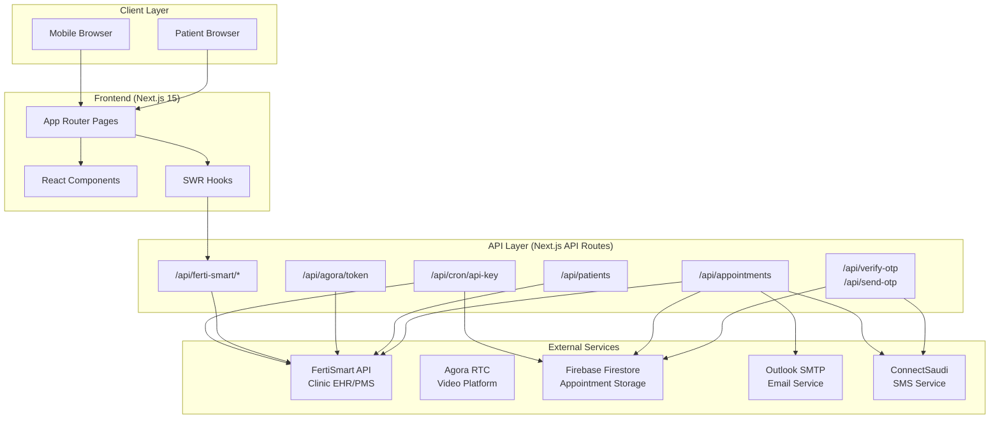
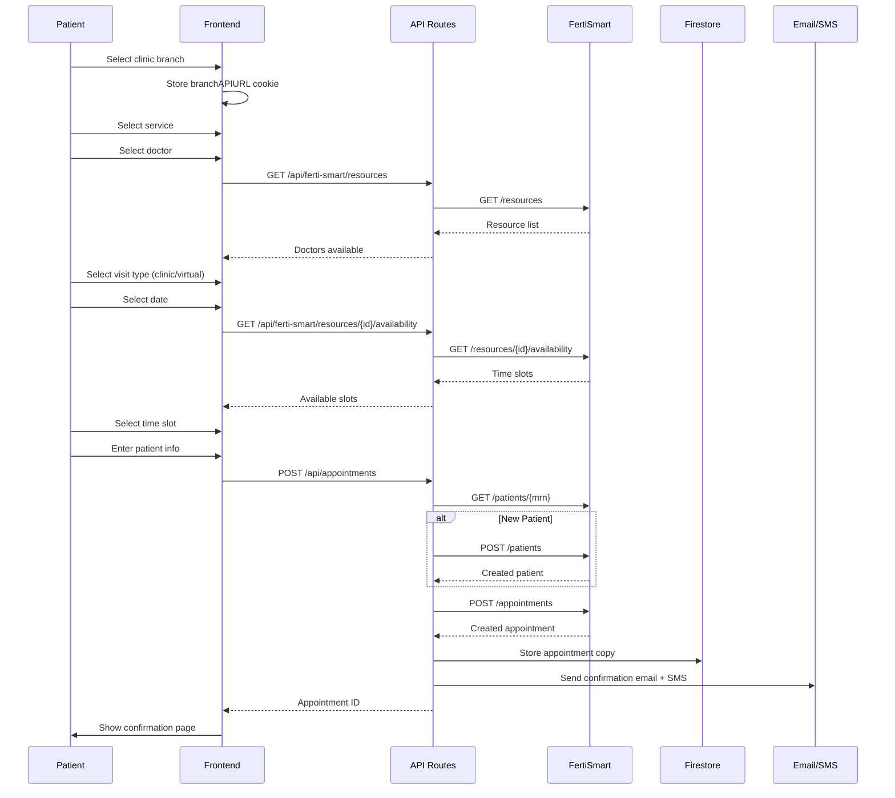
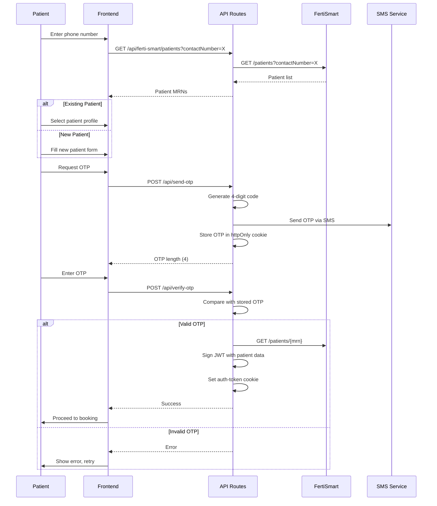
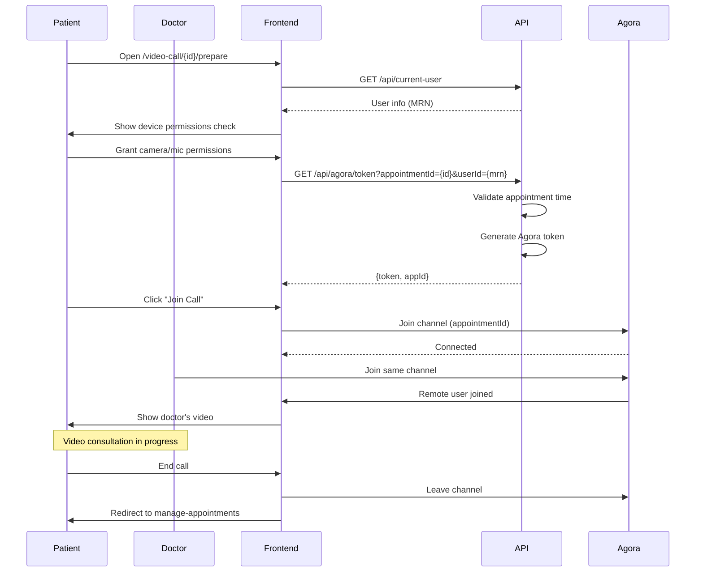

# Architecture Documentation

## System Overview



## Component Breakdown

### Frontend Architecture

```
┌─────────────────────────────────────────────────────────────────┐
│                        App Shell                                 │
│  ┌───────────────────────────────────────────────────────────┐  │
│  │                    NavHeader                               │  │
│  │  [Logo] [Language Toggle] [User Menu]                     │  │
│  └───────────────────────────────────────────────────────────┘  │
│  ┌───────────────────────────────────────────────────────────┐  │
│  │                    Page Content                            │  │
│  │                                                            │  │
│  │  Route-specific components rendered here                   │  │
│  │                                                            │  │
│  └───────────────────────────────────────────────────────────┘  │
│  ┌───────────────────────────────────────────────────────────┐  │
│  │                    Toast Container                         │  │
│  └───────────────────────────────────────────────────────────┘  │
└─────────────────────────────────────────────────────────────────┘
```

### Key React Components

| Component | Purpose | Location |
|:----------|:--------|:---------|
| `ClinicCard` | Displays clinic branch info with selection | `components/ClinicCard.tsx` |
| `DoctorCard` | Shows doctor profile with availability badge | `components/DoctorCard.tsx` |
| `ServiceCard` | Service type selection card | `components/ServiceCard.tsx` |
| `VisitTypeCard` | Clinic vs Virtual visit picker | `components/VisitTypeCard.tsx` |
| `AvailabilityPicker` | Radio-style option selector | `components/AvailabilityPicker.tsx` |
| `VerifyPhoneNumberForm` | Phone + OTP verification | `components/VerifyPhoneNumberForm.tsx` |
| `ClinicBranchSelect` | Branch switcher dropdown | `components/ClinicBranchSelect.tsx` |
| `AppointmentCall` | Video call interface | `video-call/join/_components/AppointmentCall.tsx` |

### API Route Organization

```
/api
├── appointments/
│   ├── route.ts           # POST: Create appointment
│   └── [appointmentId]/
│       └── route.ts       # PATCH: Update appointment
├── patients/
│   ├── route.ts           # POST: Create patient
│   └── [patientId]/
│       └── route.ts       # PATCH: Update patient
├── agora/
│   └── token/
│       └── route.ts       # GET: Generate Agora token
├── ferti-smart/
│   └── [...api]/
│       └── route.ts       # Proxy: GET/POST/PATCH to FertiSmart
├── send-otp/
│   └── route.ts           # POST: Send OTP via SMS
├── verify-otp/
│   └── route.ts           # POST: Verify OTP code
├── current-user/
│   └── route.ts           # GET: Get current user from JWT
├── current-branch/
│   └── route.ts           # GET: Get current branch from cookie
├── switch-branch/
│   └── route.ts           # POST: Change active branch
├── cron/
│   └── api-key/
│       └── route.ts       # GET: Rotate FertiSmart API keys
└── logout/
    └── route.ts           # POST: Clear auth cookie
```

## Data Flow

### Appointment Booking Flow



### Authentication Flow



### Video Call Flow



## Scaling Considerations

### Current Limitations

1. **Static Data Model**: Doctors, clinics, and services are hardcoded. Adding/modifying requires code deployment.

2. **ngrok Tunnels**: FertiSmart APIs are accessed via ngrok URLs, which:
   - May have rate limits
   - URLs can change
   - Single point of failure per branch

3. **Single Server**: No horizontal scaling strategy. Stateless design allows for it, but no infrastructure in place.

4. **Cookie-based Branch Selection**: Branch context stored in cookie limits cross-branch operations.

### Scaling Recommendations

1. **Move Static Data to Database**: Store doctors, clinics, services in Firestore with admin UI for management.

2. **Dedicated API Gateway**: Replace ngrok with proper API gateway (Azure API Management, Kong, etc.)

3. **Implement Caching**:
   - Cache doctor availability with short TTL
   - Cache clinic/doctor metadata with longer TTL
   - Use SWR's built-in caching more aggressively

4. **Message Queue for Notifications**: Move email/SMS sending to background queue (Bull, SQS) to avoid blocking appointment creation.

5. **CDN for Static Assets**: Images are in `/public`, should be served via CDN in production.

## Security Architecture

### Authentication

- **Method**: Phone OTP + JWT
- **Token Storage**: `auth-token` httpOnly cookie (1-year expiry)
- **Token Payload**: MRN, name, phone, email, branchId
- **No Refresh Token**: Users re-authenticate if token expires

### Authorization

- **Patient-only Access**: All endpoints validate JWT
- **No Role-based Access**: Single patient role
- **Branch Isolation**: Patients can only access their registered branch's data

### API Security

- **FertiSmart**: Rotating API keys stored in Firestore
- **Agora**: Tokens scoped to specific appointment channel
- **CORS**: Next.js default (same-origin)

### Data Protection

- **HTTPS Only**: Enforced via Vercel deployment
- **No PII Logging**: Avoid logging patient data
- **Firestore Rules**: Should restrict to authenticated users (verify configuration)
