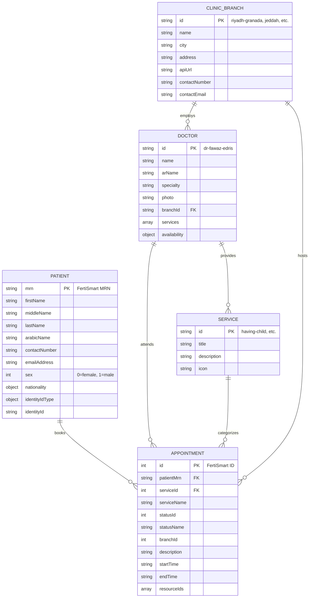

# Database Schema

## Overview

This project uses **Firebase Firestore** as its database. Firestore is a NoSQL document database, so there's no fixed schema, but the following documents the expected document structures.

The primary data source is **FertiSmart** (the clinic's EHR system). Firestore is used for:
1. Storing appointment copies for reminder functionality
2. Storing rotating API keys for FertiSmart authentication

## Entity Relationship Diagram



## Firestore Collections

### Collection: `appointments`

Stores copies of appointments created through the platform.

**Document ID:** Appointment ID from FertiSmart (string)

**Document Structure:**
```typescript
{
  // Core appointment data (from CreateAppointmentPayload)
  id: string;                    // FertiSmart appointment ID
  patientMrn: string;            // Patient's Medical Record Number
  firstName?: string;
  middleName?: string;
  lastName?: string;
  phoneNumber: string;
  email?: string;

  // Service details
  serviceId: number;
  serviceName: string;

  // Status
  statusId: number;
  statusName: string;            // "Approved/Confirmed", "Cancelled"

  // Branch & Resource
  branchId: number;
  resourceIds: number[];         // Doctor IDs

  // Timing
  startTime: string;             // ISO 8601 datetime
  endTime: string;               // ISO 8601 datetime

  // Visit type
  description: string;           // "Virtual Visit" or custom

  // Metadata
  createdAt: string;             // ISO 8601 datetime
  baseAPIURL: string;            // Branch API URL used for creation
}
```

**Indexes Required:**
- `startTime` (ascending) - for reminder queries
- `statusName` (equality) - for filtering active appointments

**Example Query (Reminder Job):**
```typescript
db.collection('appointments')
  .where('startTime', '>=', startTimeFrom)
  .where('startTime', '<=', startTimeTo)
  // Note: statusName filter done in application code
```

---

### Collection: `api_keys`

Stores FertiSmart API keys that are rotated periodically.

**Document ID:** FertiSmart API base URL (URL-encoded string)

**Document Structure:**
```typescript
{
  apiURL: string;       // Base URL of FertiSmart API
  key: string;          // Current API key
  createdAt: Timestamp; // When this key was saved
}
```

**Example:**
```javascript
// Document ID: "https://unvaunted-weedily-jannie.ngrok-free.dev"
{
  apiURL: "https://unvaunted-weedily-jannie.ngrok-free.dev",
  key: "AMpEg6pwR1VKgjnJQ4NUgJ2Sy3gVi77yBfjqL74q",
  createdAt: Timestamp
}
```

---

## Static Data (In-Code)

The following entities are stored as TypeScript constants, not in a database:

### Clinic Locations (`src/models/ClinicModel.ts`)

```typescript
type ClinicBranchID = "riyadh-granada" | "riyadh-king-salman" | "jeddah" | "al-ahsa";

interface ClinicLocation {
  id: ClinicBranchID;
  name: string;
  city: string;
  address: string;
  doctors: string;
  apiUrl: string | null;
  imageSrc: string;
  contactNumber: string;
  contactEmail: string;
  isCommingSoon?: boolean;
  locationLink: string;
}
```

### Doctors (`src/models/DoctorModel.ts`)

```typescript
interface DoctorModel {
  id: string;
  name: string;
  arName: string;
  specialty: string;
  photo: string;
  imageClassName?: string;
  availability: {
    clinic: boolean;
    virtual: boolean;
  };
  languages: string[];
  branchId: ClinicBranchID;
  services: ServiceID[];
}
```

### Services (`src/models/ServiceModel.ts`)

```typescript
type ServiceID =
  | "having-child"
  | "general-fertility"
  | "fertility-preservation"
  | "pregnancy-followup"
  | "male-andrology";

interface Service {
  id: ServiceID;
  title: string;
  description: string;
  icon: string;
  imageSrc?: string;
}
```

---

## FertiSmart Data (External API)

The following entities exist in FertiSmart and are accessed via API:

### Patient (`FertiSmartPatientModel`)
- Primary identifier: `mrn` (Medical Record Number)
- Contains personal info, nationality, ID documents

### Appointment (`FertiSmartAppointmentModel`)
- Contains booking details, status, assigned resources

### Resource (`FSResourceModel`)
- FertiSmart's representation of doctors/healthcare providers
- `linkedUserFullName` used to match with local doctor data

### Branch (`FertiSmartBranchModel`)
- FertiSmart's representation of clinic branches

### Appointment Status (`FertiSmartAppointmentStatusModel`)
- Status values like "Approved/Confirmed", "Cancelled"

### API Service (`AppointmentServiceModel`)
- FertiSmart's representation of bookable services

---

## Data Synchronization

### FertiSmart → Firestore

Appointments are created in both systems:
1. Primary record in FertiSmart (source of truth)
2. Copy in Firestore (for reminder functionality)

**Sync Points:**
- Creation: Firestore copy created when appointment booked
- Updates: Firestore not automatically synced when FertiSmart updated
- Deletes: Firestore not automatically synced when cancelled

### Firestore → FertiSmart

API keys are stored in Firestore and retrieved for each FertiSmart request:
1. Cron job rotates keys in FertiSmart
2. New key saved to Firestore
3. Axios interceptor fetches key from Firestore for each request

---

## Firestore Security Rules

**Recommended Configuration:**
```javascript
rules_version = '2';
service cloud.firestore {
  match /databases/{database}/documents {
    // Appointments: server-side access only
    match /appointments/{appointmentId} {
      allow read, write: if false; // Only backend access
    }

    // API Keys: server-side access only
    match /api_keys/{keyId} {
      allow read, write: if false; // Only backend access
    }
  }
}
```

Note: All Firestore access is from Next.js API routes using admin SDK, so client rules can be restrictive.

---

## Migration Strategy

Since the app uses:
1. **Static data in code** - No migrations needed, just code changes
2. **Firestore (schemaless)** - No schema migrations needed
3. **FertiSmart as source of truth** - Migrations managed by FertiSmart team

To add new fields:
1. Update TypeScript interfaces
2. Handle missing fields with defaults in code
3. New documents will have new fields, old documents gracefully degrade
